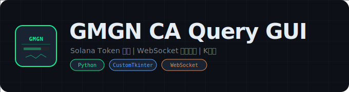

<div align="center">
  

  # GMGN CA Query GUI

  **Solana Token CA 信息查询与实时监控桌面工具**

  [](https://python.org)
  [](https://github.com/TomSchimansky/CustomTkinter)
  []()
  [](LICENSE)
</div>

---

> **注意**: GMGN 接口已启用反爬机制，本工具当前可能不可用。仅作为代码参考保留。

## 项目概述

GMGN CA Query GUI 是一个基于 CustomTkinter + wxPython + WebSocket 的 Solana Token 信息查询与实时监控桌面应用。用户输入代币合约地址（CA），系统通过 GMGN REST API 获取代币基础数据（市值、成交额、安全指标），同时通过 WebSocket 订阅实时交易流和 K 线数据，在 GUI 中展示实时买卖记录并标注交易者类型（聪明钱、狙击手、老鼠仓、创建者等），另外通过 wxPython 内嵌浏览器渲染 GMGN K 线图。

## 技术栈

- **CustomTkinter**: 现代化 Tkinter GUI 框架（Light 主题）
- **wxPython**: 内嵌 WebView 浏览器渲染 K 线图
- **websocket-client**: GMGN WebSocket 实时数据订阅
- **http.client**: GMGN REST API 查询
- **threading**: 多线程（WebSocket 监听、wxPython 窗口）
- **ttk.Treeview**: 实时交易流表格展示

## 功能特性

- **CA 查询** -- 输入 Solana 代币合约地址，通过 GMGN API 查询代币详细信息
- **数据概览面板** -- 展示总市值、流通市值、成交额、24h 成交额、黑名单状态、烧池子状态、老鼠仓百分比、mint 丢弃状态、DEV 状态
- **跑路概率评估** -- 综合黑名单、mint 权限、冻结权限、烧池子比例四个维度，自动评估为低/中/高风险
- **实时交易流** -- WebSocket 订阅 `token_activity` 频道，实时展示买卖交易（时间、类型、金额、数量、价格、钱包、交易者类型）
- **交易者标注** -- 自动识别并标注交易者类型：顶级持仓、老鼠仓、聪明钱、狙击手、创建者小号、创建者、散户
- **K 线图** -- 通过 wxPython WebView 内嵌 GMGN K 线页面，支持 1 分钟 K 线实时更新
- **实时 K 线数据** -- WebSocket 订阅 `token_kline` 频道，实时更新 24h 成交额
- **交易过滤** -- 自动过滤金额低于 0.01 USD 的微小交易
- **右键复制** -- 交易列表支持右键菜单复制选中行数据
- **列表限制** -- 交易列表最多保留 100 条记录，自动清理旧数据

## 安装说明

1. 克隆仓库到本地：
   ```bash
   git clone https://github.com/Past-Tang/gmgn-ca-query-gui.git
   cd gmgn-ca-query-gui
   ```

2. 安装依赖：
   ```bash
   pip install customtkinter wxPython websocket-client
   ```

## 使用方法

1. 启动应用：
   ```bash
   python main.py
   ```

2. 在输入框中输入 Solana 代币的合约地址（CA）

3. 点击"查询"按钮，系统会：
   - 通过 REST API 获取代币基础数据并展示在概览面板
   - 启动 WebSocket 连接订阅实时交易流和 K 线数据
   - 打开 wxPython 窗口展示 K 线图

## 界面布局

```
+--------------------------------------------------+
|  CA 输入: [________________] [查询]               |
+--------------------------------------------------+
|  数据概览                                         |
|  总市值: XX    流通市值: XX    成交额: XX          |
|  24h成交额: XX  黑名单: 否    烧池子: XX          |
|  老鼠仓%: XX   mint丢弃: 是   DEV状态: 已放弃     |
|  跑路概率: 低                                     |
+--------------------------------------------------+
|  详细数据[实时更新]                                |
|  时间 | 类型 | 交易额USD | 数量 | 价格 | 钱包 | 类型 |
|  ...  | 买入 | 1234.56  | ...  | ...  | ...  | 聪明钱 |
+--------------------------------------------------+
```

## 数据概览指标

| 指标 | 数据来源 | 说明 |
|:---|:---|:---|
| 总市值 | `price * total_supply` | 代币总市值 |
| 流通市值 | `总市值 * (1 - top10持仓率)` | 扣除 Top10 持仓后的流通市值 |
| 成交额 | `volume_24h` | 24 小时成交额 |
| 黑名单 | `is_show_alert` | 是否被标记为风险代币 |
| 烧池子 | `burn_status` | 流动性池销毁状态 |
| 老鼠仓百分比 | `top_10_holder_rate` | Top10 持仓占比 |
| mint 丢弃 | `renounced_mint` | 是否已放弃铸币权限 |
| DEV 状态 | `renounced_freeze_account` | 是否已放弃冻结权限 |
| 跑路概率 | 综合评估 | 低/中/高（基于 4 个安全因子） |

## 交易者类型标注

| 标签 | 中文名称 | 说明 |
|:---|:---|:---|
| `top_holder` | 顶级持仓 | 持仓量排名靠前的地址 |
| `rat_trader` | 老鼠仓 | 疑似内幕交易地址 |
| `pump_smart` | 聪明钱 | 历史盈利率高的地址 |
| `sniper` | 狙击手 | 新币上线后极早买入的地址 |
| `dev_team` | 创建者小号 | 与创建者关联的地址 |
| `creator` | 创建者 | 代币创建者地址 |
| - | 散户 | 无特殊标签的普通地址 |

## 项目结构

```
gmgn-ca-query-gui/
├── main.py              # 主应用（347行）：GUI + REST API + WebSocket + K线
│   ├── CADataWidget     # CustomTkinter 主窗口类
│   ├── fetch_api_data() # GMGN REST API 查询
│   ├── start_websocket()# WebSocket 连接管理
│   ├── subscribe_to_token() # 订阅 K线 + 交易流
│   ├── update_overview_data() # 更新概览面板
│   ├── update_activity_data() # 更新实时交易
│   └── show_kline_window()    # wxPython K线窗口
├── websocket_test.py    # Playwright WebSocket 测试脚本（50行）
├── blockchain_checkin.py # 区块链签到辅助脚本
├── assets/
│   └── logo.svg         # 项目 Logo
├── LICENSE              # MIT 许可证
└── README.md
```

## WebSocket 订阅

系统连接 `wss://ws.gmgn.ai/stream` 并订阅两个频道：

| 频道 | 数据 | 用途 |
|:---|:---|:---|
| `token_kline` | 1 分钟 K 线数据 | 更新 24h 成交额 |
| `token_activity` | 实时买卖交易 | 更新交易流表格 |

## 依赖项

| 包 | 用途 |
|:---|:---|
| customtkinter | 现代化 GUI 框架 |
| wxPython | 内嵌浏览器渲染 K 线图 |
| websocket-client | WebSocket 实时数据 |

## 常见问题

### 查询返回错误？
GMGN 接口已启用反爬机制（Cloudflare 等），可能需要更新请求头或使用代理。

### K 线图窗口不显示？
wxPython 的 WebView 依赖系统浏览器引擎，确保已安装 wxPython 且系统有可用的浏览器内核。

### WebSocket 连接失败？
检查网络是否可以访问 `wss://ws.gmgn.ai`，可能需要科学上网环境。

## 安全注意事项

- 本工具不涉及任何私钥或钱包操作，仅查询公开链上数据
- GMGN API 请求使用模拟浏览器 User-Agent，可能违反其服务条款
- 跑路概率评估仅供参考，不构成投资建议

## 许可证

[MIT License](LICENSE)

## 免责声明

本工具仅供学习研究使用，不构成任何投资建议。加密货币交易存在极高风险，代币安全评估结果仅供参考，不保证准确性。使用者需自行承担所有投资风险。